# Molochain Platform Architecture Diagrams

> **Generated**: December 24, 2025  
> **Purpose**: Visual representation of system architecture and data flow  
> **Format**: Mermaid.js diagrams (viewable in GitHub, VS Code, etc.)

---

## 1. Application Architecture (Repository Structure)

> **Note**: In production, this runs on a single Node.js server (PM2) with Nginx reverse proxy. 
> Subdomains (mololink.molochain.com, admin.molochain.com) are handled by subdomain middleware.

---

## 2. Frontend Route Structure

---

## 3. Backend Route Registration Flow

```mermaid
graph TB
    subgraph Entry["🚪 Entry Point"]
        RoutesTS["routes.ts<br/>(registerRoutes)"]
    end

    subgraph DirectRoutes["📌 Direct Routes"]
        ContactRoutes["/api/contact"]
        DriveRoutes["/api/drive"]
        SettingsRoutes["/api/settings"]
        DashboardRoutes["/api/dashboards"]
        ProjectsRoutes["/api/projects"]
        DocsRoutes["/api/docs<br/>/api/openapi.json<br/>/api/postman-collection"]
    end

    subgraph Registrars["🗂️ Domain Registrars"]
        AdminReg["registerAdminRoutes()<br/>/api/admin/*"]
        ServicesReg["registerServiceRoutes()<br/>/api/*"]
        AnalyticsReg["registerAnalyticsRoutes()<br/>/api/analytics, /api/performance"]
        SecurityReg["registerSecurityRoutes()<br/>/api/auth, /api/identity"]
        EcosystemReg["registerEcosystemRoutes()<br/>/api/cms, /api/mololink"]
        CollabReg["registerCollaborationRoutes()<br/>/api/collaborative-documents"]
    end

    subgraph RouteFiles["📁 Route Handlers"]
        AdminUsers["admin-users.ts"]
        AdminSecurity["admin-security.ts"]
        Mololink["mololink.ts"]
        APIDocumentation["api-documentation.ts"]
        Performance["performance.ts"]
    end

    RoutesTS --> DirectRoutes
    RoutesTS --> Registrars
    
    AdminReg --> AdminUsers & AdminSecurity
    EcosystemReg --> Mololink
    RoutesTS --> APIDocumentation
    AnalyticsReg --> Performance
```

---

## 4. Mololink Module Architecture

---

## 5. Authentication Flow

---

## 6. WebSocket Architecture

---

## 7. Data Flow: Page Load Example

---

## 8. File Structure Overview

```mermaid
graph LR
    subgraph Root["📁 Project Root"]
        Client["client/"]
        Server["server/"]
        Shared["shared/"]
        Docs["docs/"]
    end

    subgraph ClientDir["📁 client/src/"]
        Pages["pages/<br/>(131 TSX files)"]
        Routes["routes/<br/>(9 route modules)"]
        Components["components/<br/>(UI library)"]
        Hooks["hooks/<br/>(Custom hooks)"]
        Contexts["contexts/<br/>(React contexts)"]
        Modules["modules/<br/>(Feature modules)"]
        Lib["lib/<br/>(Utilities)"]
    end

    subgraph ServerDir["📁 server/"]
        RoutesTS["routes.ts"]
        RoutesDir["routes/<br/>(30 route files)"]
        Registrars["registrars/<br/>(6 domain registrars)"]
        Core["core/<br/>(Auth, Cache, Monitor)"]
        Services["services/<br/>(Business logic)"]
        Middleware["middleware/<br/>(Request handlers)"]
        API["api/<br/>(Additional endpoints)"]
    end

    subgraph SharedDir["📁 shared/"]
        Schema["schema.ts<br/>(Drizzle models)"]
        Types["types.ts<br/>(Shared interfaces)"]
    end

    Root --> ClientDir & ServerDir & SharedDir
    Client --> ClientDir
    Server --> ServerDir
    Shared --> SharedDir
```

---

## Legend

| Symbol | Meaning |
|--------|---------|
| 🌐 | Client/Browser layer |
| ⚙️ | Backend/Server layer |
| 💾 | Database layer |
| 📦 | CDN/Proxy layer |
| 🔌 | External integrations |
| 📍 | Route registration |
| 📁 | File/Directory |
| 📄 | Page component |
| 🔗 | Subdomain |
| 📡 | Real-time events |
| 👥 | Users/Clients |

---

## Viewing These Diagrams

1. **GitHub**: Renders Mermaid automatically
2. **VS Code**: Install "Mermaid Preview" extension
3. **Online**: Paste into [mermaid.live](https://mermaid.live)
4. **CLI**: Use `mmdc` from `@mermaid-js/mermaid-cli`

---

*Last Updated: December 24, 2025*
