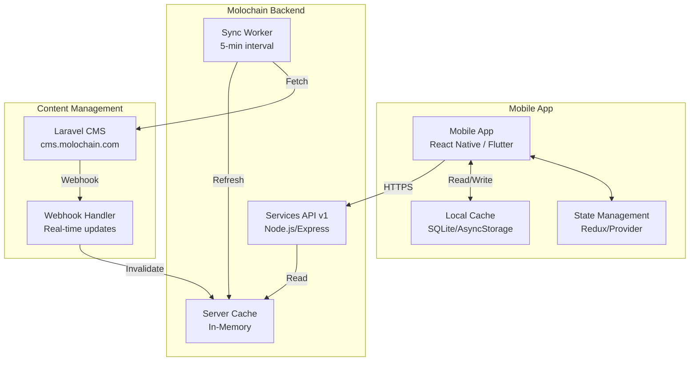
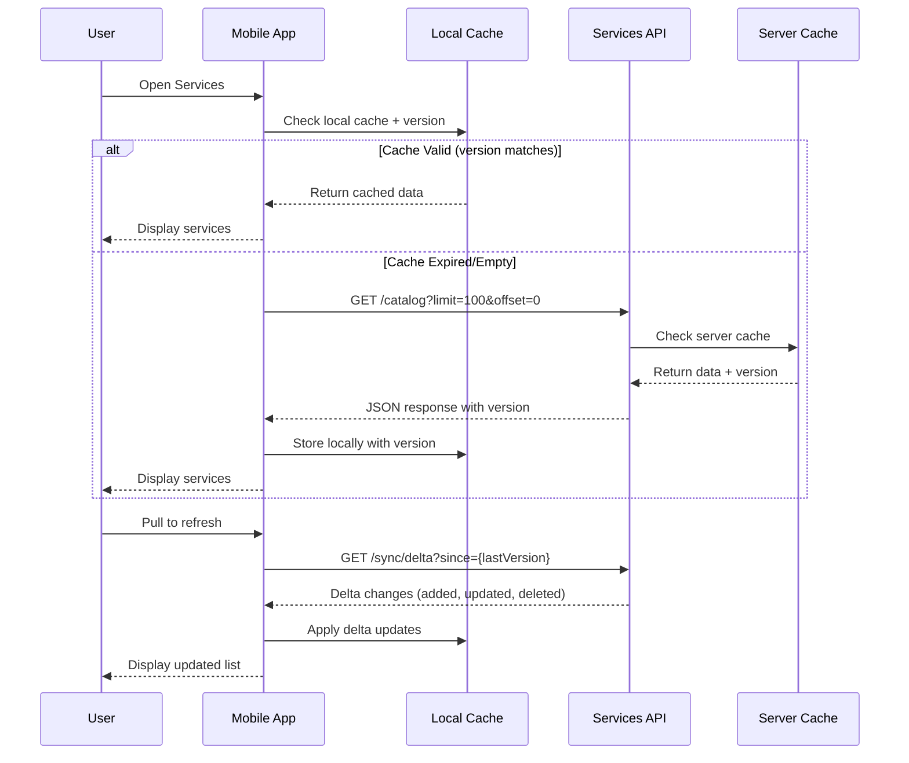
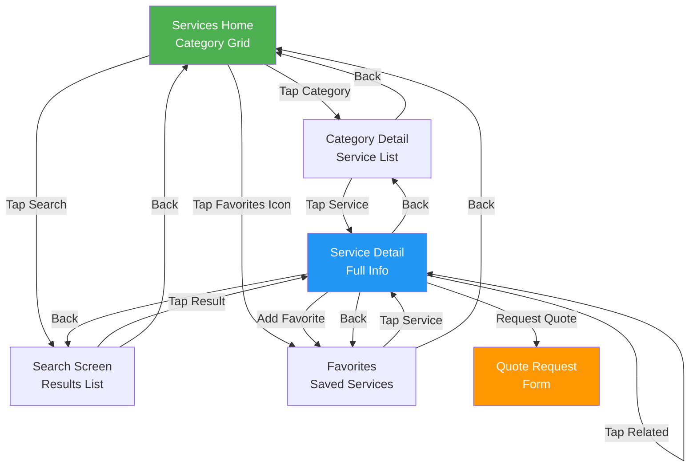

# Molochain Mobile App - Services Module Integration Guide

**Version:** 1.0  
**Date:** December 28, 2025  
**API Base URL:** `https://molochain.com/api/platform/services/v1`

---

## Table of Contents

1. [Overview](#overview)
2. [Architecture](#architecture)
3. [API Documentation](#api-documentation)
4. [Data Models](#data-models)
5. [Screen Specifications](#screen-specifications)
6. [Screen Flow Diagram](#screen-flow-diagram)
7. [Implementation Guide](#implementation-guide)
8. [Offline Support](#offline-support)
9. [Error Handling](#error-handling)
10. [Developer Agent Prompt](#developer-agent-prompt)

---

## Overview

### Purpose
Build a **Services (Business & Logistics)** module for the Molochain mobile application that displays available business and logistics services, allows users to search and browse by category, and view detailed service information.

### Current Production Stats
| Metric | Value |
|--------|-------|
| Total Services | 46 |
| Categories | 10 |
| API Response Time | < 200ms |
| Cache Refresh | Every 5 minutes |
| Uptime | 99.9% |

### Key Features
- Browse services by category
- Full-text search across all services
- Service detail view with features and benefits
- Favorites/bookmarks (local storage)
- Offline support via version-based delta sync
- Service availability checking by location

---

## Architecture

### System Architecture Diagram



### Data Flow



---

## API Documentation

### Base URL
```
Production: https://molochain.com/api/platform/services/v1
```

### Authentication
| Endpoint Type | Auth Required |
|---------------|---------------|
| Read operations (catalog, search) | No |
| User actions (favorites, requests) | Yes - JWT Bearer Token |

```http
Authorization: Bearer <user_jwt_token>
```

---

### Endpoints

#### 1. Get Service Catalog

Retrieves paginated list of all services.

```http
GET /catalog
GET /catalog?limit=50&offset=0
```

**Query Parameters:**
| Parameter | Type | Default | Max | Description |
|-----------|------|---------|-----|-------------|
| limit | number | 100 | 500 | Items per request |
| offset | number | 0 | - | Skip N items |

**Response:**
```json
{
  "success": true,
  "data": [
    {
      "id": "container-shipping",
      "title": "Container Shipping",
      "description": "International container shipping services for FCL and LCL cargo.",
      "category": "shipping",
      "icon": "container",
      "imageUrl": "https://cms.molochain.com/storage/services/container.jpg",
      "features": [
        "FCL (Full Container Load)",
        "LCL (Less than Container Load)",
        "Reefer containers",
        "Dangerous goods handling"
      ],
      "benefits": [
        "Global network coverage",
        "Competitive rates",
        "Real-time tracking"
      ],
      "additionalInfo": "Available for all major ports worldwide",
      "relatedServices": ["freight-forwarding", "customs-clearance"],
      "pricing": "Quote based - contact for rates",
      "deliveryTime": "14-45 days depending on route",
      "coverage": "Global",
      "tags": ["sea", "international", "cargo"],
      "serviceStats": [
        { "label": "Routes", "value": "200+", "icon": "route" },
        { "label": "Ports", "value": "150+", "icon": "anchor" }
      ],
      "certifications": ["ISO 9001", "AEO"],
      "isActive": true,
      "popularity": 95,
      "createdAt": "2024-01-15T00:00:00.000Z",
      "updatedAt": "2025-12-28T10:30:00.000Z"
    }
  ],
  "meta": {
    "total": 46,
    "limit": 100,
    "offset": 0,
    "categories": ["shipping", "logistics", "warehousing", "customs", "consulting", "technology", "finance", "documentation", "special", "other"]
  },
  "version": 1735391400000,
  "timestamp": "2025-12-28T12:00:00.000Z"
}
```

---

#### 2. Get Single Service

Retrieves detailed information for a specific service by slug/ID.

```http
GET /catalog/:slug
```

**Example:**
```http
GET /catalog/container-shipping
GET /catalog/trucking
GET /catalog/warehousing
```

**Response:**
```json
{
  "success": true,
  "data": {
    "id": "trucking",
    "title": "Road Freight & Trucking",
    "description": "Comprehensive road freight solutions including FTL, LTL, and express delivery services.",
    "category": "logistics",
    "icon": "truck",
    "imageUrl": "https://cms.molochain.com/storage/services/trucking.jpg",
    "features": [
      "FTL (Full Truck Load)",
      "LTL (Less than Truck Load)",
      "Express delivery",
      "Temperature-controlled transport"
    ],
    "benefits": [
      "Door-to-door service",
      "Flexible scheduling",
      "GPS tracking"
    ],
    "additionalInfo": "Coverage across Europe, Middle East, and Central Asia",
    "relatedServices": ["warehousing", "last-mile-delivery"],
    "pricing": "From $1.50/km",
    "deliveryTime": "1-5 days",
    "coverage": "Regional",
    "tags": ["land", "domestic", "express"],
    "serviceStats": [
      { "label": "Fleet", "value": "500+", "icon": "truck" },
      { "label": "Countries", "value": "25", "icon": "globe" }
    ],
    "certifications": ["ISO 14001", "GDP"],
    "isActive": true,
    "popularity": 88,
    "createdAt": "2024-01-15T00:00:00.000Z",
    "updatedAt": "2025-12-28T09:00:00.000Z"
  },
  "availability": [
    {
      "id": 1,
      "serviceId": "trucking",
      "location": "Europe",
      "available": true,
      "capacity": 85,
      "nextAvailable": null,
      "createdAt": "2024-01-15T00:00:00.000Z"
    },
    {
      "id": 2,
      "serviceId": "trucking",
      "location": "Middle East",
      "available": true,
      "capacity": 60,
      "nextAvailable": null,
      "createdAt": "2024-01-15T00:00:00.000Z"
    }
  ],
  "relatedServices": [
    {
      "id": "warehousing",
      "title": "Warehousing & Storage",
      "description": "Modern warehousing facilities...",
      "category": "warehousing",
      "popularity": 82
    }
  ],
  "version": 1735391400000,
  "timestamp": "2025-12-28T12:00:00.000Z"
}
```

---

#### 3. Get Categories

Retrieves all service categories with counts.

```http
GET /categories
```

**Response:**
```json
{
  "success": true,
  "data": [
    {
      "category": "shipping",
      "count": 8,
      "description": "Sea and ocean freight services"
    },
    {
      "category": "logistics",
      "count": 12,
      "description": "Land transport and distribution"
    },
    {
      "category": "warehousing",
      "count": 6,
      "description": "Storage and inventory management"
    },
    {
      "category": "customs",
      "count": 4,
      "description": "Customs clearance and brokerage"
    },
    {
      "category": "consulting",
      "count": 3,
      "description": "Supply chain consulting"
    },
    {
      "category": "technology",
      "count": 5,
      "description": "Digital logistics solutions"
    },
    {
      "category": "finance",
      "count": 3,
      "description": "Trade finance and insurance"
    },
    {
      "category": "documentation",
      "count": 2,
      "description": "Documentation services"
    },
    {
      "category": "special",
      "count": 2,
      "description": "Specialized cargo handling"
    },
    {
      "category": "other",
      "count": 1,
      "description": "Other services"
    }
  ],
  "timestamp": "2025-12-28T12:00:00.000Z"
}
```

---

#### 4. Search Services

Full-text search across all services with filtering.

```http
GET /search?q=:keyword
GET /search?q=shipping&category=logistics&limit=20&offset=0
```

**Query Parameters:**
| Parameter | Type | Required | Default | Description |
|-----------|------|----------|---------|-------------|
| q | string | No | - | Search keyword |
| category | string | No | - | Filter by category |
| tags | string | No | - | Comma-separated tags |
| isActive | boolean | No | true | Filter active only |
| limit | number | No | 50 | Max results (max 100) |
| offset | number | No | 0 | Skip N results |
| sortBy | string | No | popularity | popularity, title, createdAt, updatedAt |
| sortOrder | string | No | desc | asc or desc |

**Response:**
```json
{
  "success": true,
  "data": [
    {
      "id": "container-shipping",
      "title": "Container Shipping",
      "description": "International container shipping...",
      "category": "shipping",
      "icon": "container",
      "features": ["FCL", "LCL", "Reefer"],
      "benefits": ["Global coverage", "Competitive rates"],
      "isActive": true,
      "popularity": 95
    }
  ],
  "meta": {
    "query": "shipping",
    "total": 8,
    "limit": 50,
    "offset": 0
  },
  "timestamp": "2025-12-28T12:00:00.000Z"
}
```

---

#### 5. Check Service Availability

Check service availability by location.

```http
GET /availability/:serviceId
GET /availability/:serviceId?location=Europe
```

**Query Parameters:**
| Parameter | Type | Required | Description |
|-----------|------|----------|-------------|
| location | string | No | Filter by specific location |

**Response:**
```json
{
  "success": true,
  "data": {
    "serviceId": "container-shipping",
    "locations": [
      {
        "id": 1,
        "serviceId": "container-shipping",
        "location": "Europe",
        "available": true,
        "capacity": 90,
        "nextAvailable": null,
        "createdAt": "2024-01-15T00:00:00.000Z"
      },
      {
        "id": 2,
        "serviceId": "container-shipping",
        "location": "Asia Pacific",
        "available": true,
        "capacity": 75,
        "nextAvailable": null,
        "createdAt": "2024-01-15T00:00:00.000Z"
      },
      {
        "id": 3,
        "serviceId": "container-shipping",
        "location": "Middle East",
        "available": false,
        "capacity": 0,
        "nextAvailable": "2025-01-05T00:00:00.000Z",
        "createdAt": "2024-01-15T00:00:00.000Z"
      }
    ]
  },
  "timestamp": "2025-12-28T12:00:00.000Z"
}
```

---

#### 6. Delta Sync (Offline Support)

Get services modified since a specific version for incremental sync.

**IMPORTANT:** Uses numeric version (timestamp in milliseconds), not ISO date string.

```http
GET /sync/delta?since=:version
```

**Example:**
```http
GET /sync/delta?since=1735300000000
```

**Response (with changes):**
```json
{
  "success": true,
  "data": {
    "version": 1735300000000,
    "timestamp": "2025-12-27T10:00:00.000Z",
    "services": {
      "added": [],
      "updated": [
        {
          "id": "container-shipping",
          "title": "Container Shipping",
          "description": "Updated description...",
          "category": "shipping",
          "updatedAt": "2025-12-28T10:30:00.000Z"
        }
      ],
      "deleted": ["old-service-id"]
    },
    "nextVersion": 1735391400000,
    "hasMore": false
  },
  "timestamp": "2025-12-28T12:00:00.000Z"
}
```

**Response (no changes):**
```json
{
  "success": true,
  "data": {
    "version": 1735391400000,
    "timestamp": "2025-12-28T12:00:00.000Z",
    "services": {
      "added": [],
      "updated": [],
      "deleted": []
    },
    "nextVersion": 1735391400000,
    "hasMore": false
  },
  "timestamp": "2025-12-28T12:00:00.000Z"
}
```

---

## Data Models

**Important Note on Date Fields:**  
The backend uses `Date` objects, but JSON responses serialize dates as **ISO 8601 strings** (e.g., `"2025-12-28T12:00:00.000Z"`). The interfaces below use `string` for dates to match what mobile apps receive over HTTP. Parse these strings to native Date/DateTime objects in your app as needed.

**Important Note on Version Field:**  
The `version` field is a **numeric timestamp in milliseconds** (Unix epoch). Store it as a number/integer, not a string. Use this value for delta sync comparisons.

### TypeScript Interfaces

```typescript
// Service Category Types
type ServiceCategory =
  | 'shipping'
  | 'logistics'
  | 'warehousing'
  | 'customs'
  | 'consulting'
  | 'technology'
  | 'finance'
  | 'documentation'
  | 'special'
  | 'other';

// Service Stats (for display cards)
interface ServiceStats {
  label: string;
  value: string;
  icon?: string;
}

// Main Service Model
interface ServicePlatform {
  id: string;
  title: string;
  description: string;
  category: ServiceCategory | string;
  icon?: string | null;
  imageUrl?: string | null;
  features: string[];
  benefits: string[];
  additionalInfo?: string | null;
  relatedServices?: string[] | null;
  pricing?: string | null;
  deliveryTime?: string | null;
  coverage?: string | null;
  tags?: string[] | null;
  serviceStats?: ServiceStats[] | null;
  certifications?: string[] | null;
  isActive: boolean;
  popularity: number;
  createdAt: string | null;
  updatedAt: string | null;
}

// Service Availability
interface ServiceAvailability {
  id: number;
  serviceId: string;
  location: string;
  available: boolean;
  capacity?: number | null;
  nextAvailable?: string | null;
  createdAt: string | null;
}

// Category Summary
interface CategorySummary {
  category: string;
  count: number;
  description?: string;
}

// API Response Types
interface ServiceListResponse {
  success: boolean;
  data: ServicePlatform[];
  meta: {
    total: number;
    limit: number;
    offset: number;
    categories: string[];
  };
  version: number;
  timestamp: string;
}

interface ServiceDetailResponse {
  success: boolean;
  data: ServicePlatform | null;
  availability?: ServiceAvailability[];
  relatedServices?: ServicePlatform[];
  version: number;
  timestamp: string;
}

interface ServiceCategoriesResponse {
  success: boolean;
  data: CategorySummary[];
  timestamp: string;
}

interface ServiceSearchResponse {
  success: boolean;
  data: ServicePlatform[];
  meta: {
    query: string;
    total: number;
    limit: number;
    offset: number;
  };
  timestamp: string;
}

interface ServiceAvailabilityResponse {
  success: boolean;
  data: {
    serviceId: string;
    locations: ServiceAvailability[];
  };
  timestamp: string;
}

interface ServiceDeltaSync {
  version: number;
  timestamp: string;
  services: {
    added: ServicePlatform[];
    updated: ServicePlatform[];
    deleted: string[];
  };
  nextVersion: number;
  hasMore: boolean;
}

interface ServiceSyncDeltaResponse {
  success: boolean;
  data: ServiceDeltaSync;
  timestamp: string;
}

interface ServiceErrorResponse {
  success: false;
  error: {
    code: string;
    message: string;
    details?: Record<string, unknown>;
  };
  timestamp: string;
}
```

### Dart Models (Flutter)

```dart
class ServicePlatform {
  final String id;
  final String title;
  final String description;
  final String category;
  final String? icon;
  final String? imageUrl;
  final List<String> features;
  final List<String> benefits;
  final String? additionalInfo;
  final List<String>? relatedServices;
  final String? pricing;
  final String? deliveryTime;
  final String? coverage;
  final List<String>? tags;
  final List<ServiceStats>? serviceStats;
  final List<String>? certifications;
  final bool isActive;
  final int popularity;
  final DateTime? createdAt;
  final DateTime? updatedAt;

  ServicePlatform({
    required this.id,
    required this.title,
    required this.description,
    required this.category,
    this.icon,
    this.imageUrl,
    required this.features,
    required this.benefits,
    this.additionalInfo,
    this.relatedServices,
    this.pricing,
    this.deliveryTime,
    this.coverage,
    this.tags,
    this.serviceStats,
    this.certifications,
    required this.isActive,
    required this.popularity,
    this.createdAt,
    this.updatedAt,
  });

  factory ServicePlatform.fromJson(Map<String, dynamic> json) {
    return ServicePlatform(
      id: json['id'],
      title: json['title'],
      description: json['description'],
      category: json['category'],
      icon: json['icon'],
      imageUrl: json['imageUrl'],
      features: List<String>.from(json['features'] ?? []),
      benefits: List<String>.from(json['benefits'] ?? []),
      additionalInfo: json['additionalInfo'],
      relatedServices: json['relatedServices'] != null 
          ? List<String>.from(json['relatedServices']) 
          : null,
      pricing: json['pricing'],
      deliveryTime: json['deliveryTime'],
      coverage: json['coverage'],
      tags: json['tags'] != null ? List<String>.from(json['tags']) : null,
      serviceStats: json['serviceStats'] != null
          ? (json['serviceStats'] as List)
              .map((s) => ServiceStats.fromJson(s))
              .toList()
          : null,
      certifications: json['certifications'] != null 
          ? List<String>.from(json['certifications']) 
          : null,
      isActive: json['isActive'] ?? true,
      popularity: json['popularity'] ?? 0,
      createdAt: json['createdAt'] != null 
          ? DateTime.parse(json['createdAt']) 
          : null,
      updatedAt: json['updatedAt'] != null 
          ? DateTime.parse(json['updatedAt']) 
          : null,
    );
  }
}

class ServiceStats {
  final String label;
  final String value;
  final String? icon;

  ServiceStats({required this.label, required this.value, this.icon});

  factory ServiceStats.fromJson(Map<String, dynamic> json) {
    return ServiceStats(
      label: json['label'],
      value: json['value'],
      icon: json['icon'],
    );
  }
}

class ServiceAvailability {
  final int id;
  final String serviceId;
  final String location;
  final bool available;
  final int? capacity;
  final DateTime? nextAvailable;
  final DateTime? createdAt;

  ServiceAvailability({
    required this.id,
    required this.serviceId,
    required this.location,
    required this.available,
    this.capacity,
    this.nextAvailable,
    this.createdAt,
  });

  factory ServiceAvailability.fromJson(Map<String, dynamic> json) {
    return ServiceAvailability(
      id: json['id'],
      serviceId: json['serviceId'],
      location: json['location'],
      available: json['available'] ?? false,
      capacity: json['capacity'],
      nextAvailable: json['nextAvailable'] != null
          ? DateTime.parse(json['nextAvailable'])
          : null,
      createdAt: json['createdAt'] != null
          ? DateTime.parse(json['createdAt'])
          : null,
    );
  }
}

class CategorySummary {
  final String category;
  final int count;
  final String? description;

  CategorySummary({
    required this.category,
    required this.count,
    this.description,
  });

  factory CategorySummary.fromJson(Map<String, dynamic> json) {
    return CategorySummary(
      category: json['category'],
      count: json['count'] ?? 0,
      description: json['description'],
    );
  }
}
```

---

## Screen Specifications

### Screen List

| # | Screen | Route | Description |
|---|--------|-------|-------------|
| 1 | Services Home | `/services` | Category grid with search bar |
| 2 | Category Detail | `/services/category/:category` | Services list within category |
| 3 | Service Detail | `/services/:id` | Full service information |
| 4 | Search Results | `/services/search` | Search results page |
| 5 | Favorites | `/services/favorites` | User's saved services |

---

### Screen 1: Services Home

**Purpose:** Main entry point showing categories grid and search

**UI Components:**
- Header with title "Services"
- Search bar (prominent)
- Category grid (2 columns)
- Each category card shows: icon, category name (capitalized), service count

**API Call:**
```http
GET /categories
```

**Wireframe:**
```
┌─────────────────────────────────┐
│  ← Services                  ⚙️  │
├─────────────────────────────────┤
│  ┌─────────────────────────────┐│
│  │ 🔍 Search services...       ││
│  └─────────────────────────────┘│
├─────────────────────────────────┤
│  ┌──────────┐  ┌──────────┐    │
│  │   🚢     │  │   🚛     │    │
│  │ Shipping │  │ Logistics │    │
│  │ 8 services│  │12 services│   │
│  └──────────┘  └──────────┘    │
│                                 │
│  ┌──────────┐  ┌──────────┐    │
│  │   🏭     │  │   📋     │    │
│  │Warehousing│ │ Customs  │    │
│  │ 6 services│  │ 4 services│   │
│  └──────────┘  └──────────┘    │
│                                 │
│  ┌──────────┐  ┌──────────┐    │
│  │   💼     │  │   💻     │    │
│  │Consulting│  │Technology│    │
│  │ 3 services│  │ 5 services│   │
│  └──────────┘  └──────────┘    │
└─────────────────────────────────┘
```

---

### Screen 2: Category Detail

**Purpose:** Show all services within a selected category

**UI Components:**
- Back navigation
- Category header (icon, name, description)
- Service list with cards (sorted by popularity)
- Pull-to-refresh

**API Call:**
```http
GET /search?category=:category&sortBy=popularity&sortOrder=desc
```

**Wireframe:**
```
┌─────────────────────────────────┐
│  ← Shipping               🔍 ⋮  │
├─────────────────────────────────┤
│  🚢 Sea and ocean freight       │
│     services                    │
├─────────────────────────────────┤
│  ┌─────────────────────────────┐│
│  │ 📦 Container Shipping       ││
│  │ International FCL/LCL cargo ││
│  │ ⭐ 95  →                    ││
│  └─────────────────────────────┘│
│                                 │
│  ┌─────────────────────────────┐│
│  │ 🚢 Bulk Cargo               ││
│  │ Dry bulk commodities        ││
│  │ ⭐ 78  →                    ││
│  └─────────────────────────────┘│
│                                 │
│  ┌─────────────────────────────┐│
│  │ 🛳️ RoRo Shipping            ││
│  │ Vehicle & rolling cargo     ││
│  │ ⭐ 72  →                    ││
│  └─────────────────────────────┘│
└─────────────────────────────────┘
```

---

### Screen 3: Service Detail

**Purpose:** Display complete service information with action buttons

**UI Components:**
- Hero section with image/icon and title
- Description text
- Features list (chips/tags)
- Benefits list
- Service stats cards
- Availability by location
- Pricing and delivery info
- Certifications badges
- Related services carousel
- Action buttons (Request Quote, Add to Favorites)

**API Call:**
```http
GET /catalog/:slug
```

**Wireframe:**
```
┌─────────────────────────────────┐
│  ←                    ❤️  Share │
├─────────────────────────────────┤
│  ┌─────────────────────────────┐│
│  │     [Service Image]         ││
│  └─────────────────────────────┘│
│      Container Shipping         │
│         Shipping                │
│         ⭐ 95 popularity        │
├─────────────────────────────────┤
│  International container        │
│  shipping services for FCL and  │
│  LCL cargo with global reach.   │
├─────────────────────────────────┤
│  Features                       │
│  ┌─────┐ ┌─────┐ ┌──────────┐  │
│  │ FCL │ │ LCL │ │ Reefer   │  │
│  └─────┘ └─────┘ └──────────┘  │
├─────────────────────────────────┤
│  Benefits                       │
│  ✓ Global network coverage      │
│  ✓ Competitive rates            │
│  ✓ Real-time tracking           │
├─────────────────────────────────┤
│  Stats                          │
│  ┌────────┐ ┌────────┐         │
│  │ 200+   │ │ 150+   │         │
│  │ Routes │ │ Ports  │         │
│  └────────┘ └────────┘         │
├─────────────────────────────────┤
│  Availability                   │
│  🟢 Europe (90% capacity)       │
│  🟢 Asia Pacific (75%)          │
│  🔴 Middle East (Jan 5)         │
├─────────────────────────────────┤
│  💰 Quote based                 │
│  ⏱️ 14-45 days delivery         │
│  🌍 Global coverage             │
├─────────────────────────────────┤
│  Certifications: ISO 9001, AEO  │
├─────────────────────────────────┤
│  Related Services               │
│  ┌────┐ ┌────┐ ┌────┐          │
│  │ ⬜ │ │ ⬜ │ │ ⬜ │          │
│  └────┘ └────┘ └────┘          │
├─────────────────────────────────┤
│  ┌─────────────────────────────┐│
│  │      Request a Quote        ││
│  └─────────────────────────────┘│
│  ┌─────────────────────────────┐│
│  │      Add to Favorites       ││
│  └─────────────────────────────┘│
└─────────────────────────────────┘
```

---

### Screen 4: Search Results

**Purpose:** Display search results with filters

**UI Components:**
- Search bar (editable, auto-focus)
- Active filters chips
- Results count
- Service cards
- Sort options

**API Call:**
```http
GET /search?q=:query&sortBy=popularity&sortOrder=desc
```

---

### Screen 5: Favorites

**Purpose:** User's bookmarked services (local storage)

**UI Components:**
- Empty state if no favorites
- Service cards with remove option
- Navigate to service detail

**Storage:** Local (AsyncStorage/SharedPreferences)

---

## Screen Flow Diagram



---

## Implementation Guide

### Recommended Tech Stack

| Layer | React Native | Flutter |
|-------|--------------|---------|
| HTTP Client | Axios / fetch | Dio |
| State Management | Redux Toolkit / Zustand | Riverpod / Provider |
| Local Storage | AsyncStorage | SharedPreferences |
| Offline DB | WatermelonDB / MMKV | Drift (SQLite) |
| Navigation | React Navigation | GoRouter |

### Folder Structure (React Native)

```
src/
├── api/
│   └── servicesApi.ts       # API calls
├── models/
│   ├── service.ts           # ServicePlatform interface
│   ├── category.ts          # CategorySummary interface
│   └── availability.ts      # ServiceAvailability interface
├── screens/
│   ├── ServicesHome.tsx
│   ├── CategoryDetail.tsx
│   ├── ServiceDetail.tsx
│   ├── SearchResults.tsx
│   └── Favorites.tsx
├── components/
│   ├── CategoryCard.tsx
│   ├── ServiceCard.tsx
│   ├── ServiceFeatures.tsx
│   ├── ServiceBenefits.tsx
│   ├── AvailabilityList.tsx
│   └── SearchBar.tsx
├── hooks/
│   ├── useServices.ts
│   ├── useCategories.ts
│   ├── useServiceDetail.ts
│   └── useFavorites.ts
├── store/
│   └── servicesSlice.ts
└── utils/
    └── syncService.ts       # Version-based delta sync logic
```

### API Service Example

```typescript
// api/servicesApi.ts
const BASE_URL = 'https://molochain.com/api/platform/services/v1';

export const servicesApi = {
  getCategories: async (): Promise<CategorySummary[]> => {
    const response = await fetch(`${BASE_URL}/categories`);
    const json = await response.json();
    if (!json.success) throw new Error(json.error?.message);
    return json.data;
  },

  getCatalog: async (params?: { limit?: number; offset?: number }): Promise<ServiceListResponse> => {
    const query = new URLSearchParams();
    if (params?.limit) query.set('limit', String(params.limit));
    if (params?.offset) query.set('offset', String(params.offset));
    
    const response = await fetch(`${BASE_URL}/catalog?${query}`);
    const json = await response.json();
    if (!json.success) throw new Error(json.error?.message);
    return json;
  },

  getService: async (slug: string): Promise<ServiceDetailResponse> => {
    const response = await fetch(`${BASE_URL}/catalog/${slug}`);
    const json = await response.json();
    if (!json.success) throw new Error(json.error?.message);
    return json;
  },

  search: async (params: {
    q?: string;
    category?: string;
    limit?: number;
    offset?: number;
    sortBy?: string;
    sortOrder?: string;
  }): Promise<ServiceSearchResponse> => {
    const query = new URLSearchParams();
    Object.entries(params).forEach(([key, value]) => {
      if (value !== undefined) query.set(key, String(value));
    });
    
    const response = await fetch(`${BASE_URL}/search?${query}`);
    const json = await response.json();
    if (!json.success) throw new Error(json.error?.message);
    return json;
  },

  getAvailability: async (serviceId: string, location?: string): Promise<ServiceAvailabilityResponse> => {
    const query = location ? `?location=${encodeURIComponent(location)}` : '';
    const response = await fetch(`${BASE_URL}/availability/${serviceId}${query}`);
    const json = await response.json();
    if (!json.success) throw new Error(json.error?.message);
    return json;
  },

  deltaSync: async (sinceVersion: number): Promise<ServiceSyncDeltaResponse> => {
    const response = await fetch(`${BASE_URL}/sync/delta?since=${sinceVersion}`);
    const json = await response.json();
    if (!json.success) throw new Error(json.error?.message);
    return json;
  }
};
```

---

## Offline Support

### Strategy

1. **Initial Load:** Fetch full catalog on first launch, store locally with version
2. **Background Sync:** Periodic delta sync every 5 minutes when online
3. **On Resume:** Check for updates when app returns to foreground using stored version
4. **Offline Mode:** Serve from local cache when no network

### Version-Based Sync Logic

```typescript
// utils/syncService.ts
import AsyncStorage from '@react-native-async-storage/async-storage';
import { servicesApi } from '../api/servicesApi';

const SYNC_VERSION_KEY = 'services_sync_version';
const SERVICES_CACHE_KEY = 'services_cache';

interface SyncState {
  version: number;
  services: ServicePlatform[];
  lastSyncTime: number;
}

export async function initializeServices(): Promise<ServicePlatform[]> {
  const cached = await AsyncStorage.getItem(SERVICES_CACHE_KEY);
  
  if (cached) {
    const state: SyncState = JSON.parse(cached);
    // Check if cache is less than 5 minutes old
    if (Date.now() - state.lastSyncTime < 5 * 60 * 1000) {
      return state.services;
    }
    // Perform delta sync
    return await performDeltaSync(state);
  }
  
  // Full sync for first time
  return await performFullSync();
}

async function performFullSync(): Promise<ServicePlatform[]> {
  const response = await servicesApi.getCatalog({ limit: 500 });
  
  const state: SyncState = {
    version: response.version,
    services: response.data,
    lastSyncTime: Date.now(),
  };
  
  await AsyncStorage.setItem(SERVICES_CACHE_KEY, JSON.stringify(state));
  return response.data;
}

async function performDeltaSync(currentState: SyncState): Promise<ServicePlatform[]> {
  try {
    const delta = await servicesApi.deltaSync(currentState.version);
    
    // No changes
    if (
      delta.data.services.added.length === 0 &&
      delta.data.services.updated.length === 0 &&
      delta.data.services.deleted.length === 0
    ) {
      // Update last sync time only
      currentState.lastSyncTime = Date.now();
      await AsyncStorage.setItem(SERVICES_CACHE_KEY, JSON.stringify(currentState));
      return currentState.services;
    }
    
    // Apply delta
    let services = [...currentState.services];
    
    // Remove deleted
    const deletedIds = new Set(delta.data.services.deleted);
    services = services.filter(s => !deletedIds.has(s.id));
    
    // Update existing
    const updatedMap = new Map(delta.data.services.updated.map(s => [s.id, s]));
    services = services.map(s => updatedMap.get(s.id) || s);
    
    // Add new
    services.push(...delta.data.services.added);
    
    // Save updated state
    const newState: SyncState = {
      version: delta.data.nextVersion,
      services,
      lastSyncTime: Date.now(),
    };
    
    await AsyncStorage.setItem(SERVICES_CACHE_KEY, JSON.stringify(newState));
    return services;
  } catch (error) {
    console.warn('Delta sync failed, returning cached data:', error);
    return currentState.services;
  }
}

export async function forceRefresh(): Promise<ServicePlatform[]> {
  return await performFullSync();
}
```

---

## Error Handling

### HTTP Status Codes

| Code | Meaning | Action |
|------|---------|--------|
| 200 | Success | Process data |
| 400 | Bad Request | Show validation error |
| 404 | Not Found | Show "Service not found" |
| 429 | Rate Limited | Retry after delay |
| 500 | Server Error | Show error, retry option |

### Error Response Format

```json
{
  "success": false,
  "error": {
    "code": "SERVICE_NOT_FOUND",
    "message": "Service 'unknown-service' not found",
    "details": {}
  },
  "timestamp": "2025-12-28T12:00:00.000Z"
}
```

### Error Codes

| Code | Description |
|------|-------------|
| INVALID_SLUG | Service slug/ID is required |
| SERVICE_NOT_FOUND | Service does not exist |
| CATALOG_ERROR | Failed to fetch catalog |
| SEARCH_ERROR | Search query failed |
| CATEGORIES_ERROR | Failed to fetch categories |
| AVAILABILITY_ERROR | Failed to check availability |
| SYNC_ERROR | Delta sync failed |

### Error UI States

- **Loading:** Skeleton/shimmer placeholders
- **Empty:** Friendly illustration + message
- **Error:** Error message + retry button
- **Offline:** Offline indicator + cached data notice

---

## Developer Agent Prompt

Use this prompt to instruct a mobile developer AI agent:

---

```
You are a senior mobile developer building a Services module for the Molochain mobile app.

## Project Context
Molochain is a digital logistics platform. The mobile app needs a Services module that displays business and logistics services (46 services across 10 categories) fetched from an existing backend API.

## API Endpoint
Base URL: https://molochain.com/api/platform/services/v1

## Available Endpoints

| Endpoint | Method | Description |
|----------|--------|-------------|
| /categories | GET | List all 10 service categories with counts |
| /catalog | GET | List all 46 services (params: limit, offset) |
| /catalog/:slug | GET | Get single service by slug/ID with availability and related services |
| /search | GET | Search services (params: q, category, tags, limit, offset, sortBy, sortOrder) |
| /availability/:serviceId | GET | Check service availability by location |
| /sync/delta | GET | Delta sync for offline support (param: since=versionNumber) |

## Key Data Model: ServicePlatform
```typescript
interface ServicePlatform {
  id: string;              // Unique identifier/slug (e.g., "container-shipping")
  title: string;           // Display name
  description: string;     // Full description
  category: string;        // Category key (shipping, logistics, warehousing, etc.)
  icon?: string;           // Icon identifier
  imageUrl?: string;       // Full image URL
  features: string[];      // Feature list
  benefits: string[];      // Benefits list
  additionalInfo?: string; // Extra information
  relatedServices?: string[]; // Related service IDs
  pricing?: string;        // Pricing description
  deliveryTime?: string;   // Delivery time estimate
  coverage?: string;       // Geographic coverage
  tags?: string[];         // Search tags
  serviceStats?: { label: string; value: string; icon?: string }[];
  certifications?: string[];
  isActive: boolean;
  popularity: number;      // Popularity score (0-100)
  createdAt: string;
  updatedAt: string;
}
```

## Required Screens
1. **Services Home** - Category grid (2 columns) with search bar. API: GET /categories
2. **Category Detail** - Services list for selected category sorted by popularity. API: GET /search?category=X&sortBy=popularity
3. **Service Detail** - Full service info including features, benefits, stats, availability, pricing, related services. API: GET /catalog/:slug
4. **Search Results** - Full-text search with filters and sorting. API: GET /search?q=X
5. **Favorites** - User's saved services stored locally

## API Response Notes
- All responses have `{ success: boolean, data: ..., timestamp: string }`
- Catalog and detail responses include `version: number` for sync tracking
- Categories return `{ category: string, count: number, description?: string }[]`
- Availability returns `{ serviceId, locations: [{ location, available, capacity, nextAvailable }] }`
- Delta sync uses numeric version (milliseconds), not ISO timestamp

## Technical Requirements
- Offline support using version-based delta sync (GET /sync/delta?since={version})
- Store last sync version and apply added/updated/deleted changes
- Local favorites storage (AsyncStorage/SharedPreferences)
- Pull-to-refresh on all lists
- Error states with retry buttons
- Loading skeletons
- No authentication required for read operations

## UI/UX Guidelines
- Use platform-native components
- Display popularity score on service cards
- Show availability status with color indicators (green=available, red=unavailable)
- Feature/benefit chips with icons where available
- Stats cards for serviceStats display
- Related services as horizontal scrollable carousel

## Implementation Priority
1. API integration layer with TypeScript types matching ServicePlatform
2. Services Home with category grid
3. Category Detail with service list (use search endpoint with category filter)
4. Service Detail screen with all sections
5. Search functionality with filters
6. Favorites with local persistence
7. Offline support with version-based delta sync

Build this module with clean architecture, proper state management, and comprehensive error handling. Use TypeScript/Dart with strict typing. Field names must match exactly: use `title` not `name`, use `popularity` for sorting, use numeric `version` for sync.
```

---

## Quick Reference Card

### Endpoints Summary

| Endpoint | Method | Auth | Cache TTL |
|----------|--------|------|-----------|
| `/categories` | GET | No | 5 min |
| `/catalog` | GET | No | 5 min |
| `/catalog/:slug` | GET | No | 1 min |
| `/search` | GET | No | 30 sec |
| `/availability/:id` | GET | No | 30 sec |
| `/sync/delta` | GET | No | None |

### Service Categories

| Category | Description |
|----------|-------------|
| shipping | Sea and ocean freight |
| logistics | Land transport |
| warehousing | Storage facilities |
| customs | Customs clearance |
| consulting | Supply chain consulting |
| technology | Digital solutions |
| finance | Trade finance |
| documentation | Document services |
| special | Specialized cargo |
| other | Other services |

### Rate Limits

| Endpoint Type | Limit |
|---------------|-------|
| Public endpoints | 100 req/min |
| Single service | 60 req/min |
| Delta sync | 30 req/min |
| Availability | 60 req/min |

---

## Support

**API Health:** https://molochain.com/api/health  
**Documentation:** This guide  
**Contact:** Molochain Development Team

---

*Last updated: December 28, 2025*
