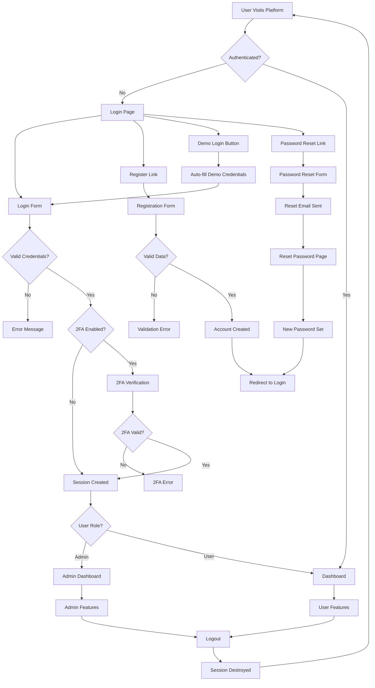

# MoloChain Authentication System - User Flow Chart

## 🔄 Complete User Authentication Flow



## 📍 Related URLs and File Paths

### 🎯 Authentication Pages
| Page | URL Route | File Path | Description |
|------|-----------|-----------|-------------|
| **Login** | `/auth/login` | `client/src/pages/auth/Login.tsx` | Main login interface with demo account |
| **Register** | `/auth/register` | `client/src/pages/auth/Register.tsx` | User registration form |
| **Password Reset Request** | `/auth/reset-password-request` | `client/src/pages/auth/RequestPasswordReset.tsx` | Request password reset |
| **Password Reset** | `/auth/reset-password` | `client/src/pages/auth/ResetPassword.tsx` | Set new password |
| **API Keys Management** | `/auth/api-keys` | `client/src/pages/auth/api-keys-management.tsx` | Manage API keys |
| **Identity Management** | `/auth/identity` | `client/src/pages/auth/identity-management.tsx` | Identity system dashboard |

### 🔐 Two-Factor Authentication
| Component | File Path | Purpose |
|-----------|-----------|---------|
| **Setup 2FA** | `client/src/components/two-factor-auth/SetupTwoFactor.tsx` | Configure 2FA |
| **Verify 2FA** | `client/src/components/two-factor-auth/VerifyTwoFactor.tsx` | Verify 2FA token |

### 🚀 Post-Authentication Destinations
| Role | URL Route | File Path | Description |
|------|-----------|-----------|-------------|
| **Admin Dashboard** | `/admin` | `client/src/pages/admin/Dashboard.tsx` | Administrative interface |
| **User Dashboard** | `/dashboard` | `client/src/pages/dashboard/MainDashboard.tsx` | User main dashboard |
| **Master Control** | `/admin/master-control` | `client/src/pages/admin/MasterControlCenter.tsx` | Admin control center |

### 🔧 Authentication API Endpoints
| Method | Endpoint | File Path | Purpose |
|--------|----------|-----------|---------|
| **POST** | `/api/auth/login` | `server/core/auth/auth.service.ts` | User login |
| **POST** | `/api/auth/register` | `server/core/auth/auth.service.ts` | User registration |
| **POST** | `/api/auth/logout` | `server/core/auth/auth.service.ts` | User logout |
| **GET** | `/api/auth/me` | `server/core/auth/auth.service.ts` | Get current user |
| **POST** | `/api/auth/2fa/setup` | `server/core/auth/two-factor.service.ts` | Setup 2FA |
| **POST** | `/api/auth/2fa/verify` | `server/core/auth/two-factor.service.ts` | Verify 2FA |
| **POST** | `/api/auth/password-reset` | `server/core/auth/password-reset.service.ts` | Password reset |

### 🛡️ Authentication Middleware & Security
| Component | File Path | Purpose |
|-----------|-----------|---------|
| **Auth Middleware** | `server/middleware/auth.ts` | Protect routes |
| **Rate Limiting** | `server/middleware/auth-rate-limit.ts` | Prevent brute force |
| **CSRF Protection** | `server/middleware/csrf.ts` | Cross-site protection |
| **API Key Auth** | `server/middleware/api-key-auth.ts` | API authentication |
| **Production Auth** | `server/middleware/production-auth.ts` | Production security |

### 🗄️ Database & Schema
| Component | File Path | Purpose |
|-----------|-----------|---------|
| **Users Schema** | `db/schema.ts` | User table definition |
| **Auth Validation** | `server/validation/auth.schemas.ts` | Input validation |
| **Password Reset Schema** | `server/validation/reset-password.schema.ts` | Reset validation |

### 🎨 Frontend Authentication Components
| Component | File Path | Purpose |
|-----------|-----------|---------|
| **Auth Hook** | `client/src/hooks/use-auth.tsx` | Authentication state |
| **Auth Utils** | `client/src/lib/authUtils.ts` | Auth utilities |
| **Protected Route** | `client/src/lib/protected-route.tsx` | Route protection |
| **Session Manager** | `client/src/components/SessionManager.tsx` | Session management |

## 🔄 User Journey States

### 1. **Anonymous User**
```
Landing Page → Services → Login Required
```

### 2. **First-Time User**
```
Registration → Email Verification → Welcome → Dashboard
```

### 3. **Returning User**
```
Login → 2FA (if enabled) → Dashboard
```

### 4. **Admin User**
```
Login → Admin Dashboard → System Controls
```

### 5. **Password Recovery**
```
Forgot Password → Email → Reset Link → New Password → Login
```

## 🎯 Key Authentication Features

### ✅ **Implemented Features**
- ✅ Session-based authentication
- ✅ JWT token support
- ✅ Two-factor authentication (TOTP)
- ✅ Password reset flow
- ✅ Role-based access control
- ✅ API key authentication
- ✅ Rate limiting protection
- ✅ CSRF protection
- ✅ Demo account system
- ✅ Identity management

### 🚀 **Authentication Flow Summary**
1. User accesses platform
2. Authentication check
3. Login/Register process
4. Optional 2FA verification
5. Role-based redirection
6. Secure session management
7. Protected resource access

## 📊 Authentication Analytics

The system tracks:
- Login attempts and success rates
- 2FA usage statistics
- Session duration metrics
- Failed authentication patterns
- Password reset frequency

All authentication events are logged and monitored through the security dashboard at `/admin/security`.
